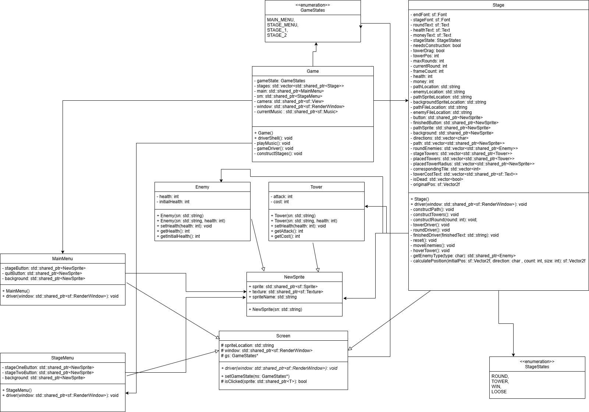

# Fish

## Installation
1. [Install git](https://git-scm.com/downloads)
2. [Install SFML](https://www.sfml-dev.org/tutorials/3.0/)
3. [Install g++ (Windows)](https://www3.cs.stonybrook.edu/~alee/g++/g++.html)
* Install g++ (Linux) using your favorite package manager
4. [Install Make](https://www.gnu.org/software/make/)
5. go to the command line and run the following:
   ```sh
   git clone https://github.com/LucasHasting/Fish.git
   cd Fish/src
   make compile
   make run
   ```

## Running Example
WIP

## UML Class Diagram


## Finite State Machine

